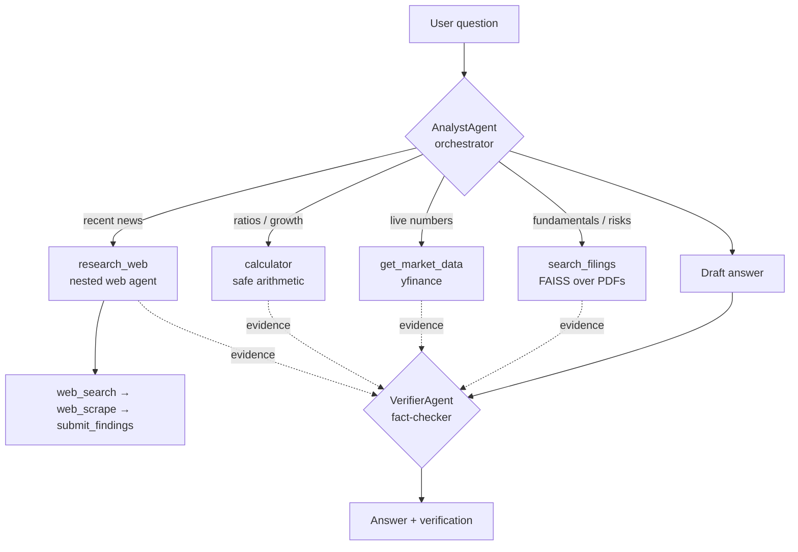

# 📈 Equity Research Agent

An **agentic** equity-research assistant. Ask an investing question in plain English and a
language model decides — at run time — how to answer it: search the **company filings** you've
loaded, pull **live market data**, do the **math**, or go to the **web** for recent news. Then a
second agent **fact-checks** the answer against the exact sources before you see it.

No orchestration graph, no hardcoded router — just a small, legible agent loop.

> ⚠️ Educational project. **Not financial advice.**

---

## What makes it "agentic"

A plain RAG pipeline is a fixed sequence *you* wrote. Here, the **model owns the control flow**:
it chooses which tools to call, in what order, how many times, and when to stop. The number and
order of steps isn't known until it runs.



**Two agents, one engine.** The `AnalystAgent` orchestrator and the nested `WebResearchAgent`
and `VerifierAgent` all subclass one ~50-line engine (`BaseAgent`) — a `while` loop over a
tool-bound model. The engine handles retries, provider fallback, and a token-bounded sliding
window; each agent just supplies tools and a prompt.

## Features

- **Multi-agent**: orchestrator → nested web-research sub-agent → fact-checking verifier.
- **Four tools**: semantic filing search (FAISS), live market data (`yfinance`), a safe
  arithmetic calculator, and web research.
- **Fact-checking**: every answer is checked claim-by-claim against the tool evidence; unsupported
  claims are flagged.
- **Resilient models**: the web agent tries Gemini, backs off (20s → 60s), then falls back to
  Groq — so a free-tier rate limit doesn't kill the run.
- **Bounded context**: a sliding window keeps token cost flat as conversations grow.
- **Three ways to use it**: interactive CLI, FastAPI service, and a Streamlit chat UI.
- **Traced**: drop in a LangSmith key and every run shows up as a nested trace.
- **Tested**: 27 unit + mocked-integration tests, no network required.

## Setup

Requires Python ≥ 3.12 and [uv](https://github.com/astral-sh/uv).

```bash
uv sync
cp .env.example .env      # then fill in your keys
```

Keys needed: `GROQ_API_KEY`, `GEMINI_API_KEY`, `SERPER_API_KEY` (all have free tiers).
`LANGSMITH_*` is optional (see below).

**Add filings**: drop 10-K / annual-report **PDFs** (or `.txt` filings from
[SEC EDGAR](https://www.sec.gov/edgar/search/)) into `documents/`. They stay local — `.gitignore`
keeps them out of the repo.

## Running

**Interactive CLI**
```bash
uv run python pipeline/analyst.py
```

**FastAPI service**
```bash
uv run fastapi run serving_api/main.py --host 0.0.0.0 --port 8000
```
- `http://localhost:8000/docs` — interactive Swagger UI (click-test the endpoints)
- `POST /chat` `{message, conversation_id?}` → `{conversation_id, answer, verification}`
- `POST /query` `{query}` → `{answer}` (stateless)

```bash
# start a conversation
curl -X POST http://localhost:8000/chat -H "Content-Type: application/json" \
  -d '{"message": "How does NVDA'\''s current P/E compare to its 52-week range?"}'
# continue it — pass the returned conversation_id back
curl -X POST http://localhost:8000/chat -H "Content-Type: application/json" \
  -d '{"conversation_id": "<id>", "message": "And versus what the filing says about margins?"}'
```

**Streamlit chat UI** (start the API first)
```bash
uv run streamlit run app/main.py
```

## LangSmith tracing (optional)

Set these in `.env` and every agent run is traced as a nested tree
(orchestrator → research_web → web agent → tools, plus the verifier):
```
LANGSMITH_TRACING=true
LANGSMITH_API_KEY=your_key
LANGSMITH_PROJECT=equity-research-agent
```

## Tests

```bash
uv run pytest
```
All tests mock the models and network, so they're fast and offline: `ResilientChat` retry/
fallback, the sliding window, the agent loop, tool dispatch, the tools, the cache, and a mocked
end-to-end analyst → verifier flow.

## How it works (deep dive)

See [`docs/walkthrough.md`](docs/walkthrough.md) for a thorough, section-by-section explanation of
the code — the agent loop, the two termination modes, the resilience layer, the sliding window,
the nested-agent pattern, and the verifier.

## Disclaimer

This is a portfolio/educational project that demonstrates agentic architecture. It is **not
financial advice**, and model outputs may be wrong despite the verifier. Do your own research.
